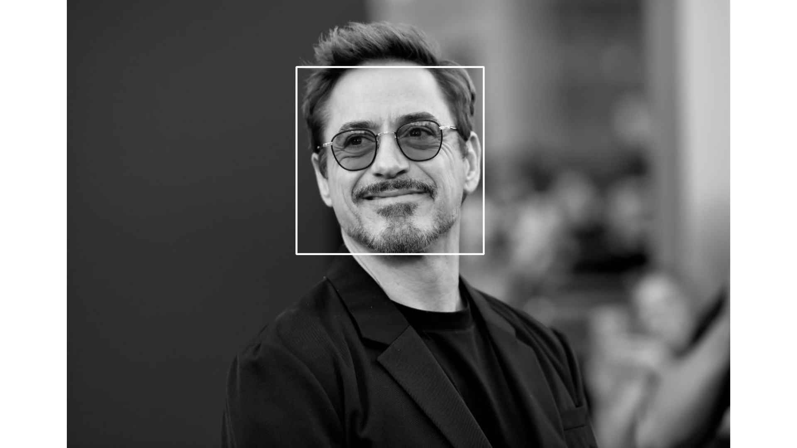
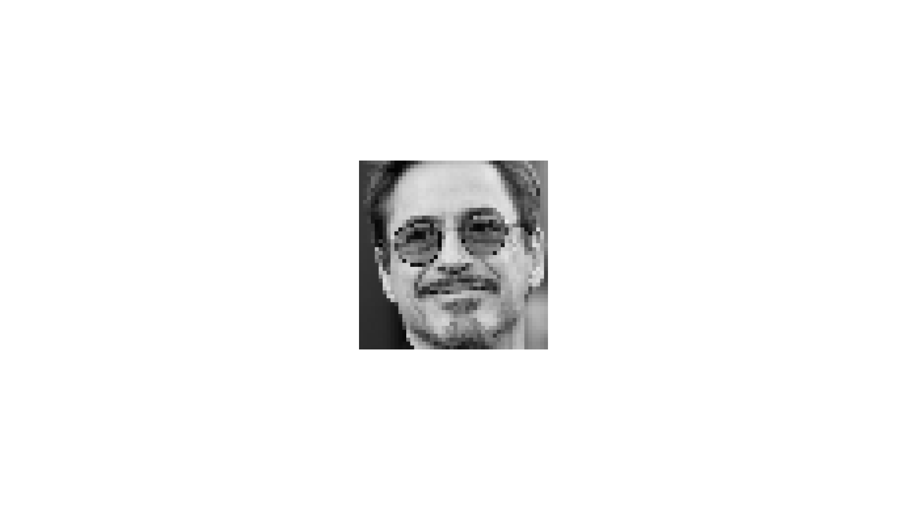
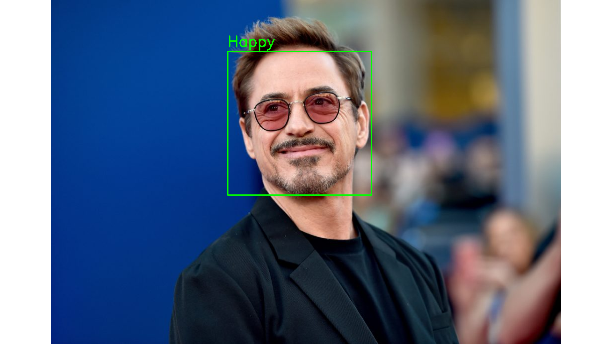

# Facial Expression Recognition

A Facial Expression Recognition system developed using PyTorch and OpenCV. This can be used to recognize various facial expressions such as Anger, Disgust, Fear, Happy, Sad, Surprise and Neutral. This can be used to detect a peron's mood by analyzing their facial expression.

## Contents

- [Technologies Used](#technologies-used)
- [Dataset](#dataset)
- [Model Training](#model-training)
- [Image Processing & Inference](#image-processing--inference)
  - [Step 1: Image Reading & Processing](#step-1-image-reading--processing)
  - [Step 2: Face Detection](#step-2-face-detection)
  - [Step 3: Cropping and Resizing the Face Image](#step-3-cropping-and-resizing-the-face-image)
  - [Step 4: Inference](#step-4-inference)
  - [Step 5: Adding the Label and Bounding Box to the Original Image](#step-5-adding-the-label-and-bounding-box-to-the-original-image)

## Technologies Used

| Name    | Description                                                                                                                                                                                                      |
| ------- | ---------------------------------------------------------------------------------------------------------------------------------------------------------------------------------------------------------------- |
| PyTorch | PyTorch is an open source machine learning library based on the Torch library, used for applications such as computer vision and natural language processing, primarily developed by Facebook's AI Research lab. |
| OpenCV  | OpenCV is a library of programming functions mainly aimed at real-time computer vision.                                                                                                                          |

## Dataset

The model was trained on the [FER-2013 Dataset](https://www.kaggle.com/c/challenges-in-representation-learning-facial-expression-recognition-challenge). This dataset consists of grayscale images of faces of size 48x48 pixel. The faces have already been centered in the images and the faces generally occupy the same volume of space in each image. The dataset consists of a training test and a test set. The training set consist of 28,709 images and the test set consists of 3,589 images. All images in the dataset are labelled and have been categorized into one of the seven given categories where 0=Angry, 1=Disgust, 2=Fear, 3=Happy, 4=Sad, 5=Surprise, and 6=Neutral. The images from the dataset were loaded using the DataLoader class of PyTorch. For both sets, the Grayscale transformation was applied which loads all images as grayscale images. This was followed by the ToTensor transformation which converts the images into PyTorch tensors. Then, the Normalize transformation was applied. This transformation normalizes all the images so that all the tensor values are between 0 and 1. Additionally, the RandomHorizontalFlip and RandomCrop transformations were applied to the training set to augment the data. These transformations help to extract more information from the dataset.

## Model Training

Three different models were developed so that they can be compared on various metrics and the best model can be selected for deployment. The three models that were developed were – a Shallow Convolutional Neural Network, a Deep Neural Network, a Residual Neural Network. The Residual Neural Network was based on the ResNet-9 architecture. All models were trained on the same hyperparameters to eliminate the variance that would result from different hyperparameters. The one cycle learning rate method was used where the learning rate of the optimizer starts from a lower value and slowly rises till it reaches the defined maximum value. The learning rate is then slowly reduced till we reach the lower value a few epochs before the end. Finally, in the remaining iterations, the learning rate is annihilated way below the lower learning rate value. The hyperparameters used for the training process were as follows:

| Parameter          | Value |
| ------------------ | ----- |
| Epochs             | 20    |
| Batch Size         | 256   |
| Max. Learning Rate | 0.008 |
| Optimizer          | Adam  |

All models shared some common features such as the Conv Block which was simply a 2D Convolution followed by Batch Normalization and a ReLU activation layer. The Shallow Convolutional Neural Network was built of 3 Conv Blocks, each followed by a 2D Max Pooling Layer. The output was then Flattened and passed through 2 Linear layers, each followed by a ReLU activation. A Linear layer was added as the output layer. The Deep Convolutional Neural Network had a total of 6 Conv Blocks in pairs of two, each pair was followed by a 2D Max Pooling Layer. Then, just like the Shallow CNN, the output was Flattened and passed through 2 Linear layers, each followed by a ReLU activation. A Linear layer was added as the output layer. The ResNet-9 model was based on the standard definition of the [ResNet-9 architecture](https://myrtle.ai/learn/how-to-train-your-resnet-4-architecture/).

## Image Processing & Inference

An Image processing pipeline was created which takes an image as the input and returns the predictions as the output. The following steps are performed in the image processing and inference process.

Here's a summary of all the steps involved in this process.

### Step 1: Image Reading & Processing

The image is loaded using OpenCV's imread function and is converted into a grayscale image by using the cvtColor function from the OpenCV library.

Here's what the input image looks like after loading and grayscale conversion.

### Step 2: Face Detection

Faces are detected from the input image by using the Cascade Classifier. A Haar Cascade is used because it recognizes the frontal face of a person (from forehead to the chin). The Cascade Classifier returns a list of detected faces. Each face consists of the following -

- X Co-ordinate of the top-left corner of the bounding box of the detected face.
- Y Co-ordinate of the top-left corner of the bounding box of the detected face.
- Width of the bounding rectangle of the detected face.
- Height of the bounding rectangle of the detected face.

Here's how the face is detected on the image.

### Step 3: Cropping and Resizing the Face Image

The detected face is cropped out of the entire image and is resized into an image of the size of 48x48 pixels.

Here's what the image looks like after the face is cropped out.

### Step 4: Inference

The image is then passed to the model to perform the prediction operation. The model returns the index of the class that has been predicted. The predicted expression is then selected from the classes array.

### Step 5: Adding the Label and Bounding Box to the Original Image

The bounding box and the label are added to the original image which can be returned to the user. The bounding box is added using the rectangle function of the OpenCV library and the label is added using the putText function.

Here's what the final Image looks like.

